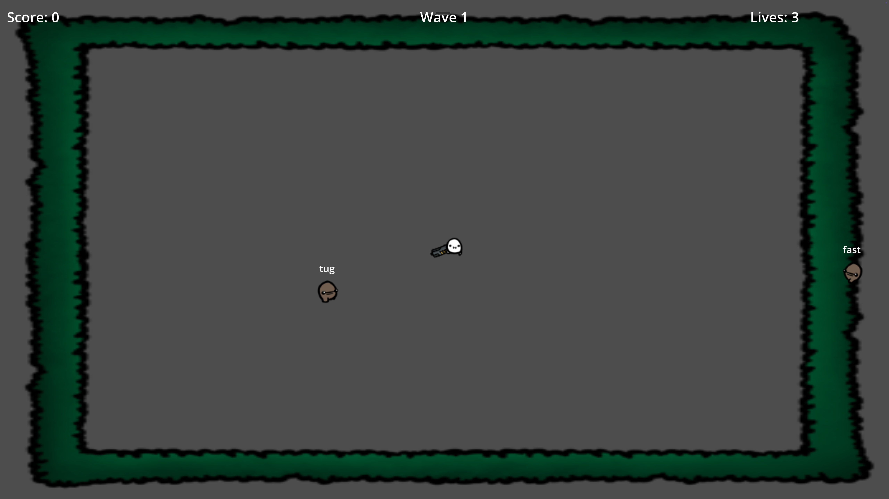
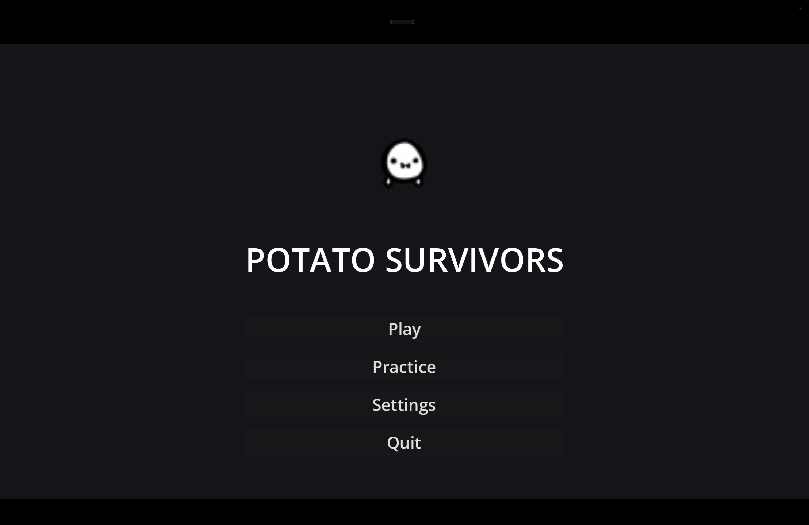

# Potato Survivors

A monster wave survivor-style typing game built in Godot 4 using Brotato assets. Enemies spawn at the edges of the arena and walk toward the center. Type their word to destroy them before they reach you.

## Play in Browser

**[potato-survivors.netlify.app](https://potato-survivors.netlify.app/)** — no download required.

## How to Play

- Enemies approach from the edges displaying a word above them
- Type the first letter to lock onto a matching enemy (it turns orange)
- Finish typing the word to destroy it
- Mistype and you lose your lock — start again
- Survive as many waves as you can

## Run Locally (Godot 4)

1. Open the project in Godot 4
2. Press **F6** to run the current scene, or set `arena.tscn` as the main scene and press **F5**

## Project Structure

| File | Purpose |
|---|---|
| `arena.tscn` / `arena.gd` | Main scene, signal wiring, score and lives |
| `enemy.tscn` / `enemy.gd` | Enemy movement, word display, death |
| `typing_engine.gd` | Keystroke input, targeting, word progress |
| `wave_manager.gd` | Enemy spawning cadence, wave escalation |
| `word_bank.gd` | Word lists by difficulty (easy / medium / hard) |
| `hud.gd` | Score, lives, wave counter, typed input display |

## Built With

- [Godot 4](https://godotengine.org/)
- GDScript with static typing
